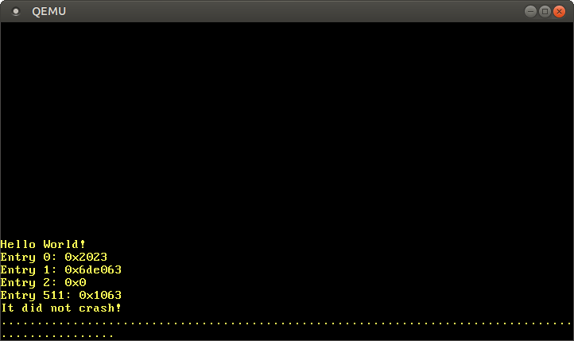

+++
title = "Paging 2"
order = 10
path = "paging-2"
date = 0000-01-01
template = "second-edition/page.html"
+++

This post TODO

<!-- more -->

This blog is openly developed on [Github]. If you have any problems or questions, please open an issue there. You can also leave comments [at the bottom].

[Github]: https://github.com/phil-opp/blog_os
[at the bottom]: #comments

## Introduction

In the [previous post] we learned about the principles of paging and how the 4-level page tables on the x86_64 architecture work. One thing that the post did not mention: **Our kernel already runs on paging**. The bootloader that we added in the ["A minimal Rust Kernel"] post already set up a 4-level paging hierarchy that maps every page of our kernel to a physical frame. The reason why the bootloader does this is that paging is manditory in 64-bit mode on x86_64.

[previous post]: ./second-edition/posts/09-paging-introduction/index.md
["A minimal Rust kernel"]: ./second-edition/posts/02-minimal-rust-kernel/index.md#creating-a-bootimage

The bootloader also sets the correct access permissions for each page, which means that only the pages containing code are executable and only data pages are writable. You can try this by accessing some memory outside our kernel:

```rust
let ptr = 0xdeadbeaf as *mut u32;
unsafe { *ptr = 42; }
```

You will see that this results in an page fault exception. (We don't have page fault handler, so you will see that the double fault handler is invoked.)

In case you are wondering how we could access the physical address `0xb8000` in order to print to the [VGA text buffer]: The bootloader identity mapped this frame, which means that it set up a page at the virtual address `0xb8000` that points to the physical frame with the same address.

[VGA text buffer]: ./second-edition/posts/03-vga-text-buffer/index.md

The question is: How do we access the page tables that our kernel runs to create new page mappings?

## Accessing Page Tables

Accessing the page tables from our kernel is not as easy as it may seem. To understand the problem let's take a look at the example 4-level page table hierarchy of the previous post again:


The important thing here is that each page entry stores the _physical_ address of the next table. This avoids the need to run a translation for these addresses too, which would be bad for performance and could easily cause endless translation loops.

The problem for us is that we can't directly access physical addresses from our kernel, since our kernel also runs on top of virtual addresses. For example when we access address 4KiB, we access the _virtual_ address 4KiB, not the _physical_ address 4KiB where the level 4 page table lives. When we want to acccess the physical address 4KiB, we can only do so through some virtual address that maps to it.

So in order access page table frames, we need to map some virtual pages to them. There are different ways to create these mappings that all allow us to access arbitrary page table frames:


- A simple solution is to **identity map all page tables** like the VGA text buffer:

  
  
  In this example we see various identity-mapped page table frames. This way the physical addresses in the page tables are also valid virtual addresses so that we can easily access the page tables of all levels starting from the CR3 register.
  
  However, it clutters the virtual address space and makes it more difficult to find continuous memory regions of larger sizes. For example, imagine that we want to create a virtual memory region of size 1000 KiB in the above graphic, e.g. for [memory-mapping a file]. We can't start the region at 26 KiB because it would collide with the already mapped page at 1004 MiB. So we have to look further until we find a large enough unmapped area, for example at 1008 KiB. This is a similar fragmentation problem as with [segmentation].

  [memory-mapping a file]: https://en.wikipedia.org/wiki/Memory-mapped_file
  [segmentation]: ./second-edition/posts/09-paging-introduction/index.md#fragmentation
  
  Equally, it makes it much more difficult to create new page tables, because we need to find physical frames whose corresponding pages aren't already in use. For example, let's assume that we reserved the 1000 KiB memory region starting at 1008 KiB for our memory-mapped file. Now we can't use any frame with a _physical_ address between 1000 KiB and 2008 KiB anymore, because we can't identity map it.

- Alternatively, we could **map the page tables frames only temporarily** when we need to access them. To be able to create the temporary mappings, we could identity map some level 1 table:

  

  The level 1 table in this graphic controls the first 2 MiB of the virtual address space. This is because it is reachable by starting at the CR3 register and following the 0th entry in the level 4, level 3, and level 2 page tables. The entry with index 8 maps the virtual page at address 32 KiB to the physical frame at address 32 KiB, thereby identity mapping the level 1 table itself. The graphic shows this identity-mapping by the horizontal arrow at 32 KiB.

  By writing to the identity-mapped level 1 table, our kernel can create up to 511 temporary mappings (512 minus the entry required for the identity mapping). In the above example, the kernel mapped the 0th entry of the level 1 table to the frame with address 24KiB. This created a temporary mapping of the virtual page at 0 KiB to the physical frame of the level 2 page table, indicated by the dashed arrow. Now the kernel can access the level 2 page table by writing to the page starting at 0 KiB.
  
  The process for accessing an arbitrary page table frame with temporary mappings would be:

  - Search for a free entry in the identity mapped level 1 table.
  - Map that entry to the physical frame of the page table that we want to access.
  - Access the target frame through the virtual page that maps to the entry.
  - Set the entry back to unused thereby removing the temporary mapping again.

  This approach keeps the virtual address space clean, since it reuses the same 512 virtual pages for creating the mappings. The drawback is that it is a bit cumbersome, especially since a new mapping might require modifications of multiple table levels, which means that we would need to repeat the above process multiple times.

- While both of the above approaches work, there is a third technique called **recursive page tables** that combines their advantages: It keeps all page table frames mapped like with the identity-mapping, so that no temporary mappings are needed, and also keeps the mapped pages together to avoid fragmentation of the virtual address space. This is the technique that we will use for our implementation, therefore it is described in detail in the following section.

## Recursive Page Tables

The idea behind this approach sounds simple: _Map some entry of the level 4 page table to the frame of level 4 table itself_, similar to how the level 1 table in the previous example mapped itself. By doing this in the level 4 table, we effectively reserve a part of the virtual address space and map all current and future page table frames to that space. Thus, the single entry makes every table of every level accessible through a calculatable address.

Let's go through an example to understand how this all works:


The only difference to the [example at the beginning of this post] is the additional entry at index 511 in the level 4 table, which is mapped to physical frame 4 KiB, the frame of the level 4 table itself.

[example at the beginning of this post]: #accessing-page-tables

By letting the CPU follow this entry on a translation, it doesn't reach a level 3 table, but the same level 4 table again. This is similar to a recursive function that calls itself, therefore this table is called a _recursive page table_. The important thing is that the CPU assumes that every entry in the level 4 table points to a level 3 table, so it now treats the level 4 table as a level 3 table. This works because tables of all levels have the exact same layout on x86_64.

By following the recursive entry one or multiple times before we start the actual translation, we can effectively shorten the number of levels that the CPU traverses. For example, if we follow the recursive entry once and then proceed to the level 3 table, the CPU thinks that the level 3 table is a level 2 table. Going further, it treats the level 2 table as a level 1 table, and the level 1 table as the mapped frame. This means that we can now read and write the level 1 page table because the CPU thinks that it is the mapped frame. The graphic below illustrates the 5 translation steps:


Similarly, we can follow the recursive entry twice before starting the translation to reduce the number of traversed levels to two:


Let's go through it step by step: First the CPU follows the recursive entry on the level 4 table and thinks that it reaches a level 3 table. Then it follows the recursive entry again and thinks that it reaches a level 2 table. But in reality, it is still on the level 4 table. When the CPU now follows a different entry, it lands on a level 3 table, but thinks it is already on a level 1 table. So while the next entry points at a level 2 table, the CPU thinks that it points to the mapped frame, which allows us to read and write the level 2 table.

Accessing the tables of levels 3 and 4 works in the same way. For accessing the level 3 table, we follow the recursive entry entry three times, tricking the CPU into thinking it is already on a level 1 table. Then we follow another entry and reach a level 3 table, which the CPU treats as a mapped frame. For accessing the level 4 table itself, we just follow the recursive entry four times until the CPU treats the level 4 table itself as mapped frame (in blue in the graphic below).


It might take some time to wrap your head around the concept, but it works quite well in practice.

### Address Calculation

We saw that we can access tables of all levels by following the recursive entry once or multiple times before the actual translation. Since the indexes into the tables of the four levels are derived directly from the virtual address, we need to construct special virtual addresses for this technique. Remember, the page table indexes are derived from the address in the following way:


Let's assume that we want to access the level 1 page table that maps a specific page. As we learned above, this means that we have to follow the recursive entry one time before continuing with the level 4, level 3, and level 2 indexes. To do that we move each block of the address one block to the right and use the set the original level 4 index to the index of the recursive entry:


For accessing the level 2 table of that page, we move each index block two blocks to the right and set both the blocks of the level 4 index and the level 3 index to the index of the recursive entry:


Accessing the level 3 table works by moving each block three blocks to the right and using the recursive index for the level 4, level 3, and level 2 address blocks:


Finally, we can access the level 4 table by moving each block four blocks to the right and using the recursive index for all address blocks except for the offset:


The page table index blocks are 9 bits, so moving each block one block to the right means a bitshift by 9 bits: `address >> 9`. To derive the 12-bit offset field from the shifted index, we need to multiply it by 8, the size of a page table entry. Through this operation, we can calculate addresses for accessing all four page tables in the mapping of each page.

The table below summarizes the address structure for accessing the different kinds of frames:

Mapped Frame for | Address Structure ([octal])
---------------- | -------------------------------
Page             | `0o_SSSSSS_AAA_BBB_CCC_DDD_EEEE` 
Level 1 Table    | `0o_SSSSSS_RRR_AAA_BBB_CCC_DDDD`
Level 2 Table    | `0o_SSSSSS_RRR_RRR_AAA_BBB_CCCC`
Level 3 Table    | `0o_SSSSSS_RRR_RRR_RRR_AAA_BBBB`
Level 4 Table    | `0o_SSSSSS_RRR_RRR_RRR_RRR_AAAA`

[octal]: https://en.wikipedia.org/wiki/Octal

Whereas `AAA` is the level 4 index, `BBB` the level 3 index, `CCC` the level 2 index, `DDD` the level 1 index, and `EEEE` the offset into the mapped frame. `RRR` is the index of the recursive entry. When an index (three digits) is transformed to an offset (four digits), it is done by multiplying it by 8 (the size of a page table entry). With this offset, the resulting address directly points to the respective page table entry.

`SSSSSS` are sign extension bits, which means that they are all copies of bit 47. This is a special requirement for valid addresses on the x86_64 architecture. We explained it in the [previous post][sign extension].

[sign extension]: ./second-edition/posts/09-paging-introduction/index.md#paging-on-x86

## Implementation

After all this theory we can finally start our implementation. As already mentioned, our kernel already runs on a page tables created by the bootloader. The bootloader also set up a recursive mapping for us, so we already can use addresses with the above structure to access the page tables. The only missing thing that we don't know is which entry is mapped recursively.

### Boot Information

To communicate the index of the recursive entry and other information to our kernel, the bootloader passes a reference to a boot information structure as an argument when calling our `_start` function. Right now we don't have this argument declared in our function, so let's add it:

```rust
// in src/main.rs

use bootloader::bootinfo::BootInfo;

#[cfg(not(test))]
#[no_mangle]
pub extern "C" fn _start(boot_info: &'static BootInfo) -> ! {
    println!("Hello World{}", "!");
    println!("boot_info: {:x?}", boot_info);

    […]
}
```

The [`BootInfo`] struct is still in an early stage, so expect some breakage in newer bootloader versions. When we print it, we see that it currently has the three fields `p4_table_addr`, `memory_map`, and `package`:

[`BootInfo`]: https://docs.rs/bootloader/0.3.11/bootloader/bootinfo/struct.BootInfo.html

![QEMU printing a `BootInfo` struct: "boot_info: Bootlnfo { p4_table_addr: fffffffffffff000. memory_map: […]. package: […]"](qemu-bootinfo-print.png)

The most interesting field for us right now is `p4_table_addr`, as it contains a virtual address that is mapped to the physical frame of the level 4 page table. As we see this address is `0xfffffffffffff000`, which indicates a recursive address with the recursive index 511.

The `memory_map` field will become relevant later in this post. The `package` field is an in-progress feature to bundle additional data with the bootloader. The implementation is not finished, so we can ignore this field for now.

### Accessing the Level 4 Page Table

We can now try to access the level 4 page table:

```rust
// inside our `_start` function

[…]

let level_4_table_pointer = boot_info.p4_table_addr as *const u64;

let entry_0 = unsafe { *level_4_table_pointer };
println!("Entry 0: {:#x}", entry_0);

let entry_1 = unsafe { *level_4_table_pointer.offset(1) };
println!("Entry 1: {:#x}", entry_1);

let entry_2 = unsafe { *level_4_table_pointer.offset(2) };
println!("Entry 2: {:#x}", entry_2);

let entry_511 = unsafe { *level_4_table_pointer.offset(511) };
println!("Entry 511: {:#x}", entry_511);

[…]
```

This code casts the `p4_table_addr` to a pointer to an `u64`. As we saw in the [previous post][page table format], each page table entry is 8 bytes (64 bits), so an `u64` represents exactly one entry. We use unsafe blocks to read from the raw pointers and the [`offset` method] to perform pointer arithmetic. When we run it, we see the following output:

[page table format]: ./second-edition/posts/09-paging-introduction/index.md#page-table-format
[`offset` method]: https://doc.rust-lang.org/std/primitive.pointer.html#method.offset



When we look at the [format of page table entries][page table format], we see that the value `0x2023` of entry 0 means that the entry is `present`, `writable`, was `accessed` by the CPU, and is mapped to frame `0x2000`. Entry 1 is mapped to frame `0x6d8000` has the same flags as entry 0, with the addition of the `dirty` flag that indicates that the page was written.

Entry 2 is not `present`, so this virtual address range is not mapped to any physical addresses. Entry 511 is mapped to frame `0x1000` with the same flags as entry 1. This is the recursive entry, which means that `0x1000` is the physical frame that contains the level 4 page table.

### Page Table Types

While accessing the page tables through raw pointers is possible, it is cumbersome and requires many uses of `unsafe`. Like always we want to avoid that by creating safe abstractions.

TODO x86_64 PageTable type

TODO directly pass &PageTable in boot_info?

TODO introduce boot_info earlier?


## A Physical Memory Map

## Allocating Stacks

## Summary

## What's next?

---
TODO update post date